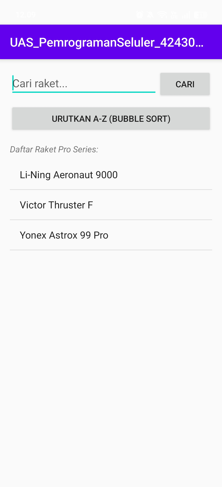
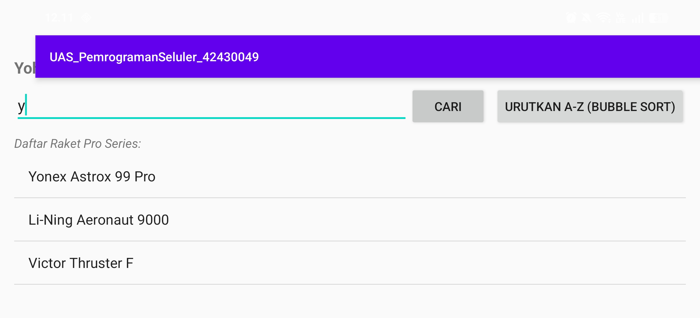
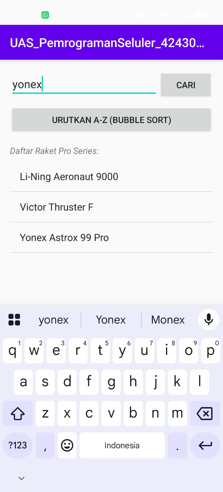
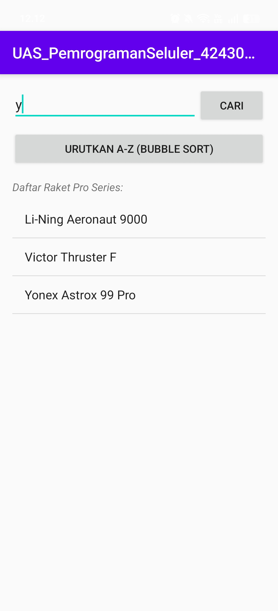
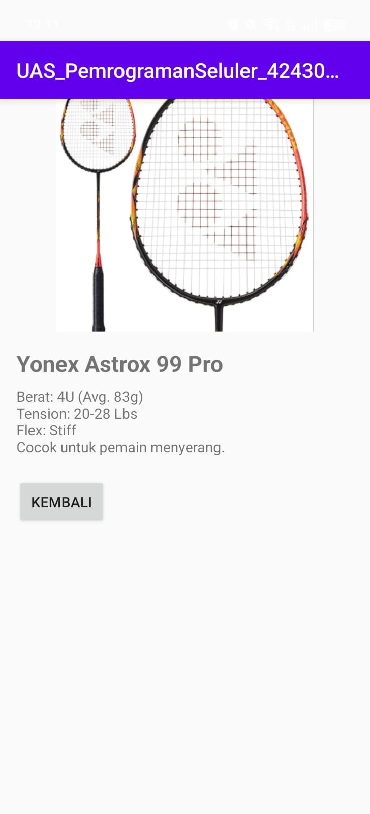

# 🏸 Aplikasi Katalog Raket Badminton (Pro Series) - Tugas Akhir UAS

Tugas Akhir untuk memenuhi ujian akhir semester mata kuliah **Pemrograman Seluler**. Aplikasi ini merupakan katalog berbasis Android Studio menggunakan bahasa pemrograman **Kotlin** untuk menampilkan lini raket badminton kelas profesional dari berbagai brand ternama.

---

## 👤 Identitas Mahasiswa
* **Nama:** Yohana Imanuel (Noni)
* **NIM:** 42430049
* **Kampus:** Universitas Pendidikan Nasional (Undiknas)
* **Semester:** 4
* **Program Studi:** S1 Ilmu Komputer

---

## 🚀 Fitur Utama Aplikasi
1. **Daftar Katalog (ListView Custom Adapter):** Menampilkan daftar raket profesional beserta logo/gambar aset mini di sebelah kiri secara dinamis.
2. **Fitur Pengurutan (Bubble Sort Algorithm):** Mengurutkan daftar raket berdasarkan abjad (A-Z) secara *real-time* saat tombol "Urutkan" ditekan.
3. **Halaman Detail (Intent Extra Passing Data):** Ketika salah satu raket diklik, aplikasi akan berpindah halaman untuk menampilkan gambar penuh raket beserta spesifikasi detail (Berat, *Tension*, dan *Flexibility*).
4. **Dukungan Tampilan Miring (Responsive Landscape Layout):** Desain tata letak antarmuka telah dioptimalkan agar tetap rapi saat layar HP diputar horizontal (`layout-land`), sesuai dengan instruksi pengerjaan UAS.

---

## 🛠️ Spesifikasi Teknologi
* **Bahasa Pemrograman:** Kotlin
* **IDE:** Android Studio
* **Komponen UI:** ListView, Custom BaseAdapter, Button, TextView, ImageView, LinearLayout
* **Metode Pengiriman Data:** Intent Explicit dengan Extra (String & Integer Resource ID)

---

## 📦 Daftar Produk yang Tersedia
| Brand & Seri Raket | Spesifikasi Utama | Tipe Permainan |
| :--- | :--- | :--- |
| **Yonex Astrox 99 Pro** | 4U (Avg. 83g), 20-28 Lbs, Stiff Flex | Menyerang / *Attacking* |
| **Li-Ning Aeronaut 9000** | 3U (Avg. 86g), Up to 32 Lbs, Flexible | Kontrol & *Power* |
| **Victor Thruster F** | 4U, 20-26 Lbs, Medium Flex | Serang & Cepat / *Speed Attacking* |

---

---

---

---

---

---

---

---

## 📸 Bukti Screenshot Aplikasi UAS

### 1. Tampilan Utama Aplikasi

**Tampilan Tegak (Portrait):**

**Tampilan Miring (Landscape):**

### 2. Pengujian Fitur Aplikasi
Berikut adalah bukti bahwa fitur pencarian data dan pengurutan Bubble Sort (A-Z) sudah berjalan lancar:

**Hasil Pencarian Data:**

**Hasil Pengurutan Data (A-Z):**

### 3. Validasi Logcat Android Studio
Berikut adalah bukti jendela Logcat di Android Studio yang menampilkan identitas NIM 42430049:

